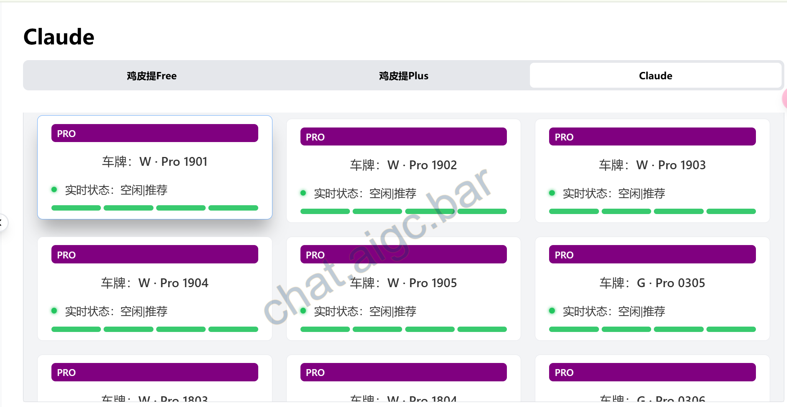
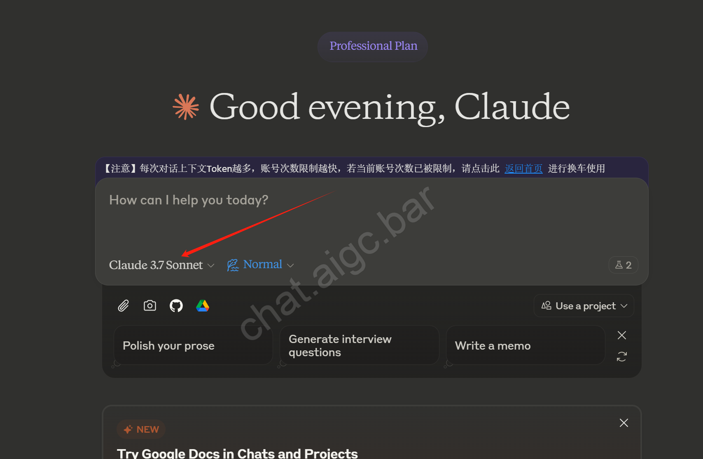

# Claude AI 中文版使用指南 ✨

> 国内访问 Claude AI 中文版的超实用指南！支持 Claude 3.7 Sonnet/Opus，无需翻墙也能玩转 Claude ai 🚀

---

## 国内超赞的 Claude AI 中文版镜像站推荐 🌈

想在国内畅快使用 Claude AI 中文版？这里给你推荐一个超棒的镜像站——**AIGC Chat**！✨ 无需翻墙，打开就能用，简单又高效！👇

- **网址**：[chat.aigc.bar](https://chat.aigc.bar/list/#/home) 🌐  
- **支持版本**：Claude 3.7 Sonnet/Opus ⚙️    
- **功能亮点**：支持全系列模型，会话漫游，中文界面，响应超快！🚀  
- **附赠功能**：免费附赠GPT,GROK最新主流模型！ 🎁

> **小贴士**：站点还集成了云端自动备份聊天记录的功能，再也不用担心因为Claude账号被风控导致记录无法找回的问题啦😊

---

## 如何快速上手 Claude AI 中文版？🚀

### 方法一：镜像站点快速体验 🌐

1. **访问镜像站**  
   进入小编的推荐站点，比如 [chat.aigc.bar](https://chat.aigc.bar/list/#/home) 🌍  
2. **注册或直接开聊**  
   - 注册：邮箱一键搞定 📧  
3. **点击选车列表** 
    
3. **进入会话选模型**  
   根据需求挑 Claude 3.7 Sonnet 或 Opus ⚙️  
 
4. **开始对话**  
   输入问题，秒得智能回答！💬  

### 方法二：官网直连（需翻墙）🌏

1. **访问官网**  
   打开 [claude.ai](https://claude.ai) 🌐  
2. **注册账号**  
   - 准备好邮箱，验证一下 📩  （注意需要国外手机号接码噢！）
   - 填基本信息，轻松注册 ✅  
3. **选择版本**  
   登录后选 Claude 3.7 Sonnet 或 Opus 🎛️  
4. **畅聊无阻**  
   输入问题，享受原汁原味的 AI 对话体验！🗣️  

---

## Claude AI 的超实用场景 🎯

### 1. 学术研究与写作 ✍️
Claude 以超强的准确性和深度分析闻名，学术党必备！  
- 分析复杂文献 📚  
- 生成研究大纲 🗂️  
- 优化学术论文 📝  

> **学术写作提示词**  
> “你是一位专业的学术写作助手👩‍🏫。请帮我分析以下研究主题，提供研究框架建议，并指出可能的方向和方法。注意学术规范和可行性哦！✅”

### 2. 代码开发与调试 💻
Claude 是程序员的超级助手，代码能力一流！  
- 代码审查与优化 🛠️  
- Bug 修复建议 🐞  
- 算法实现 📈  
- 技术文档生成 📖  

> **代码优化提示词**  
> “你是一位专业软件工程师👨‍💻。请审查这段代码，找出问题并给出优化建议，特别关注性能、可维护性和安全性！🔒”

### 3. 数据分析与商业智能 📊
Claude 能轻松搞定复杂数据，商业分析的好帮手！  
- 数据清洗与预处理 🧹  
- 统计分析+可视化建议 📉  
- 商业报告生成 📋  
- 市场趋势预测 🔮  

---

## 常见问题解答（FAQ）❓

### Q1：Claude 和其他 AI 模型有啥不一样？🤔
Claude 以准确、安全、伦理著称，尤其擅长学术、代码和复杂任务。回答超客观、超详实，上下文理解能力满分！💯  

### Q2：Claude 3.7 的亮点在哪里？✨
- 超强多模态能力 🎨  
- 更精准的分析 📊  
- 上下文理解更牛 🧠  
- 代码能力全球顶尖，自媒体写作 AI 味超低！✍️  

### Q3：怎么确认我在用 Claude？🕵️‍♂️
试试复杂推理或专业问题测试一下！推荐测试 case：  
- “一个人能娶自己遗孀的妹妹吗？”（逻辑推理）  
- “Ariana Grande 的专辑 *Eternal Sunshine* 啥时候发布的？”（正确答案：2024-03-08，区分 Claude 3.5 和 Claude 3）  

### Q4：Claude镜像 对于 Claude官方的有什么优势呢？🔐
claude国内使用，claude镜像站实现会话漫游，会话隔离，实现保护个人隐私，同时云端自动备份数据，有效避免claude账号被封无法找回数据的现象，也支持本地导出文档 无需像官网一样需要邮箱收件。🙅‍♂️  

---

## 数据隐私与安全性须知 ⚠️

1. **敏感信息保护**  
   别输入身份证、银行卡等隐私信息 🚫  
2. **网络安全**  
   优先选 HTTPS 加密站点，通信更安全 🔒  
3. **数据处理**  
   Claude 有严格保护机制，数据安全有保障 ✅  
4. **合规使用**  
   遵守法律法规，别干违法的事儿！⚖️  

---

© 2025 Claude AI 中文指南 | 用 AI 点亮生活 🌟
